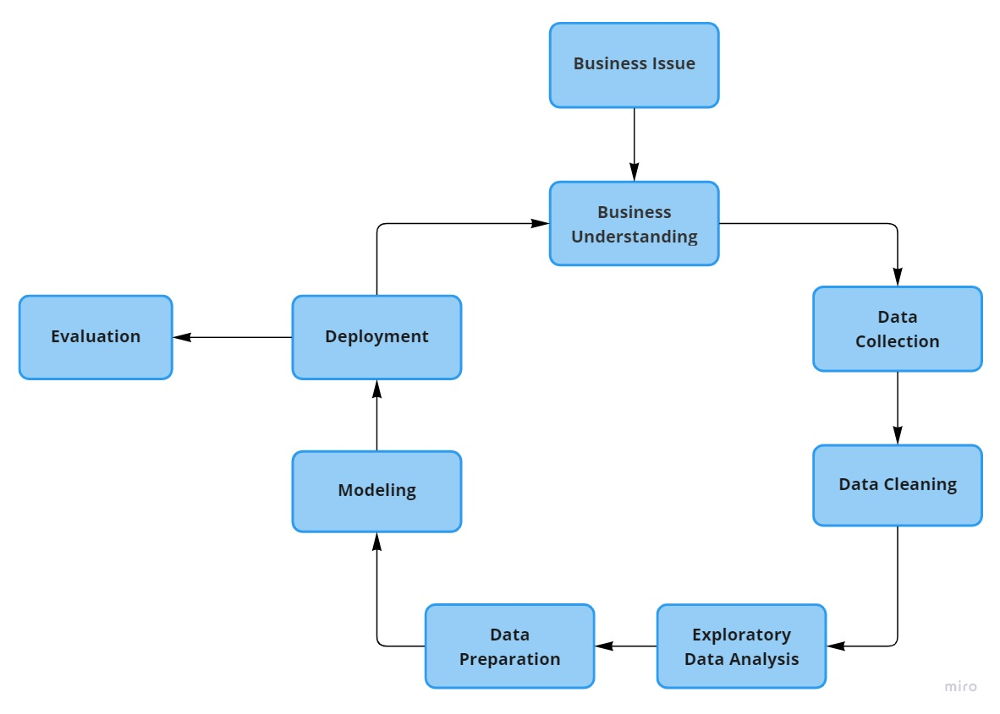
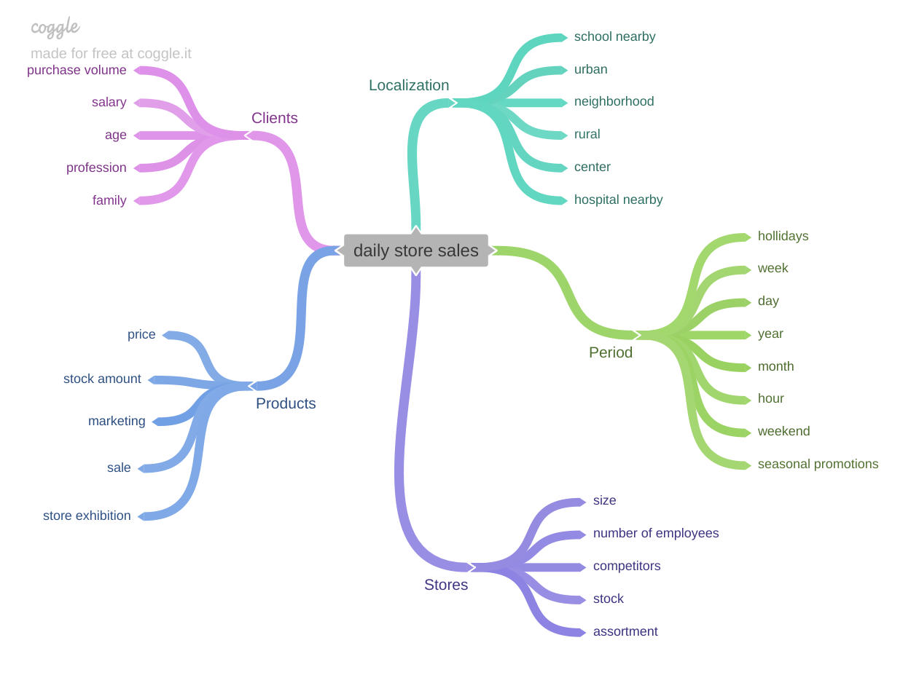
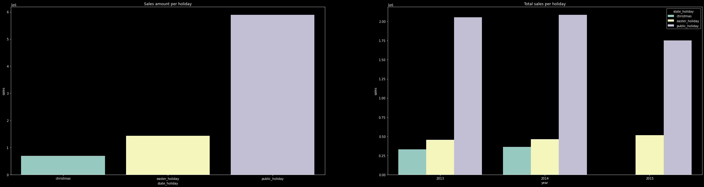
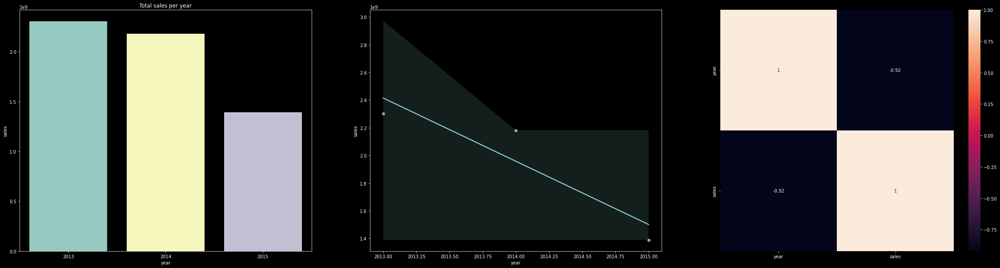
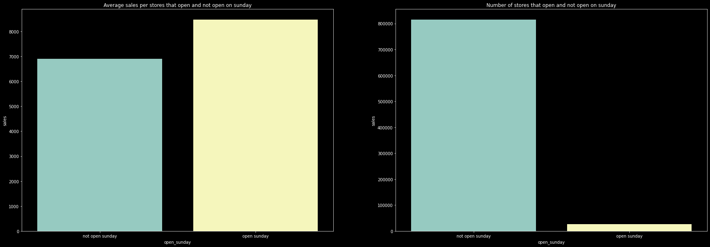
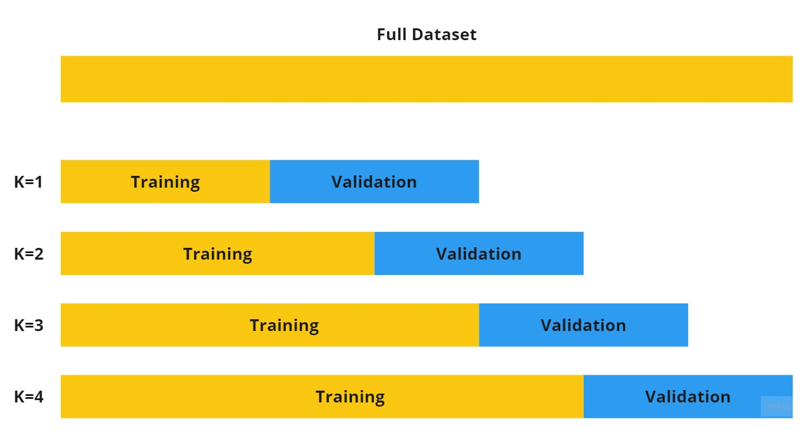
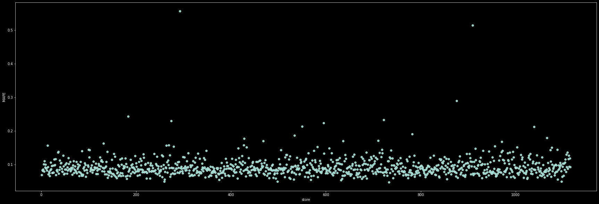
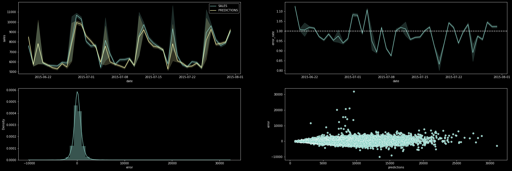
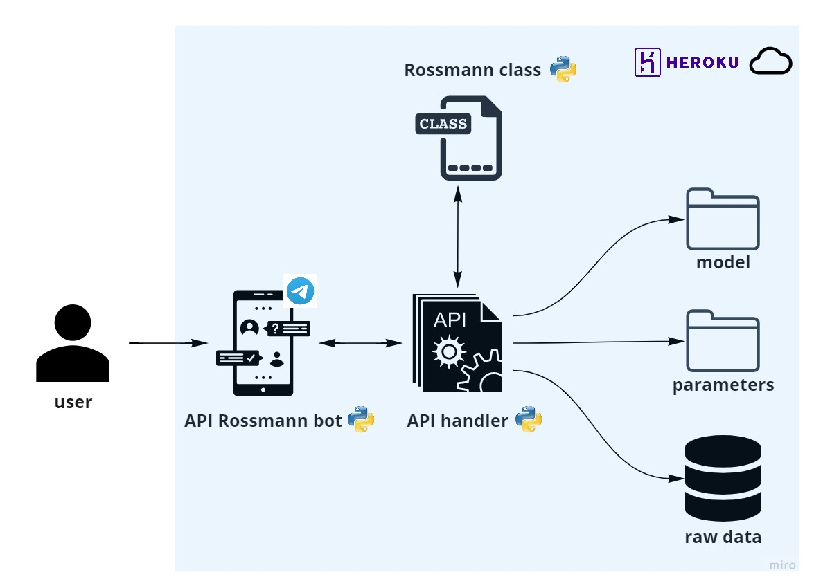

# Rossmann Sales Prediction

In this project, CRISP-DM methodology was applied to solve a fictitious business problem, using a real dataset from Kaggle, the [Rossman Store Sales](https://www.kaggle.com/c/rossmann-store-sales/data) challenge dataset.


<br/>


## Business Problem
Rossmann's CFO wants to invest in remodeling some stores. In order to know exactly how much capital he can invest, he needs to know to how much return he will get from stores sales for the next 6 weeks.

**Business Issue:** What is the total sales of each store in the next 6 weeks?

## Solution Strategy
To develop this project I used the cyclical development method applied to the CRISP-DM methodology. The main idea of the cyclic method is to be able to finish a CRISP-DM complete  cycle, following all steps below. At each new cycle, all steps are repeated, always looking to improve the solution in relation to the previous cycle.



1. Business Issue: definition of the problem to be solved
   
2. Business Understanding: detect problem motivation and it root cause, map stakeholders and identify the types of possible solutions
   
3. Data Collection: capture data from different sources and structure the final dataframe for analysis
   
4. Data Cleaning: check the types of variables, identify and handle null data, filter variables according to business constraints and select the most relevant variables for the model
   
5. Exploratory Data Analysis: create and prioritize hypotheses according to the business and available data, create new features, based on the original variables, necessary to validate the hypotheses and improve the descriptive analysis of the phenomenon to be modeled,  and explore the data and test hypotheses to find insights and better understand the impact of features on the response variable
 
6. Modeling: manipulate and transform data to a format that Machine Learning algorithms understand and can process, select the most relevant features to train the model, train models using different algorithms, calculate and compare the performance of different models, select the model to be used and identify the model parameter values that result in better performance for the problem to be solved

7. Evaluation: calculate final model performance and translate it into business impact, it means, how much financial return the model will bring to the company

8. Deploy: make model predictions accessible to any user

## Top 3 Data Insights

The first step was to design a hypotheses mental map, according to the agents and attributes that most impact the phenomenon being modeled. The second step was to define the hypotheses taking into account the variables that I believe most affect the phenomenon. And finally, I selected the hypotheses to be tested, taking into account the data I had available.



### Tested Hypotheses

**H1:** Stores with larger assortments should sell more </br>
**H2:** Stores with closer competitors should sell less</br>
**H3:** Stores with longer competitors should sell more</br>
**H4:** Stores with longer active promotions should sell more</br>
**H5:** Stores with more consecutive promotions should sell more</br>
**H6:** Stores open during the Christmas holiday should sell more</br>
**H7:** Stores should sell more over the years</br>
**H8:** Stores should sell more in the second half of the year</br>
**H9:** Stores should sell more after the 10th of each month</br>
**H10:** Stores that open on Sunday should sell more</br>
**H11:** Stores should sell less during school holidays</br>

All analyzes performed can be accessed in the notebook for more details. Below is a summary of the analysis of hypotheses H6, H8 and H10.

### H6: Stores open during the Christmas holiday should sell more
**FALSO** Stores open during the Christmas holiday sell LESS compared to other holidays

When comparing the total sales among existing holidays, Christmas is the one that sells the least, as we can see in the left chart. The right chart shows this same analysis by year, and it can be seen that from 2013 to 2014 there weren't significant changes in total sales for any holidays. As 2015 is not a closed year (data goes until July only), we do not have the Christmas holiday for this year.



### H7: Stores should sell more over the years
**FALSO** Stores sell LESS over the years

The first chart shows the total sales value of each year. In 2014, there was a drop in sales compared to the previous year, 2013. As the data for 2015 are not complete (data goes until July only), we cannot conclude that 2015 sales will be less than 2014. But knowing this scenario, it is possible to take actions to reverse the situation in the current year. In the third graph, we can see that year and sale variables are highly correlated, this indicates that the year is an important variable for the model.



### H10: Stores that open on Sunday should sell more
**VERADEIRA** Stores that open on Sundays sell MORE on average

In the right graph, we can see that the number of stores that open on Sundays (33) is much smaller than the number of stores that do not open on Sundays (1,082). But the  left graph tells us that, on average, stores that open on Sundays sell more. For a fair analysis, sales made on Sundays were not considered.



## Machine Learning Model Applied

Before applying the models, data preparation and feature selection steps were performed.

Data preparation is important to Machine Learning model algorithms be able to correctly process input data. At this stage, the following techniques were applied:
- **Encoding**: transformation of categorical variables into numeric
- **Transformação cíclica**: transformation of cyclic categorical variables into numerical, in order to preserve cycle characteristic to be taken into account by the model
- **Rescaling**: to leave numeric variables in the same range
- **Transformação Logarítmica**: to make target variable distribution closer to a normal distribution

In feature selection step, the Boruta algorithm was used in order to identify the most relevant features for the model. But to define the final set of features, the results of the analyzes carried out in the EDA stage were also taken into account.

This is a time series supervised learning problem, as it uses the historical past of the variable to project how it will behave in the next periods. Four different models were analyzed (Linear Regression, Lasso Regression, Random Forest and XGBoost Regressor) and their respective performances were evaluated with cross-validation, using the strategy shown below:



In the first iteration, the dataset was sorted in chronological order and part of the dataset was separated for model training and another part was separated for model validation (corresponding to the next 6 weeks). At each new iteration, the dataset selected for training the model was incremented with new data, always in the same proportion, always keeping the validation dataset with a fixed size, referring to the next 6 weeks. The performance of each model was calculated considering the average of all cross-validation iterations.

## Model Performance

To calculate models performance, the following metrics were analyzed: Mean Absolute Error (MAE), Mean Absolute Percentage Error (MAPE) and Root Mean Squared Error (RMSE). The results obtained were:

|Model|MAE|MAPE|RMSE|
|-----------------------------|------------------|-------------|------------------|
|Random Forest Regressor      |837.97 +/- 219.11 |0.12 +/- 0.02|1256.9 +/- 320.13 |
|XGBoost Regressor            |1035.53 +/- 191.46|0.14 +/- 0.02|1492.21 +/- 264.22|
|Linear Regression            |2081.73 +/- 295.63|0.3 +/- 0.02 |2952.52 +/- 468.37|
|Lasso Regression             |2081.64 +/- 298.77|0.3 +/- 0.02 |2955.91 +/- 471.18|

Although Random Forest had a better performance, the model chosen to be implemented was the XGBoost Regressor because it is a lighter model to operate in production compared to Random Forest. Since there is no significant difference in performance between them, the processing gain in this case will be greater than performance gain that we would have.

After defining the model to be used, the hyperparameters were adjusted using Random Search method, to find the set of parameters that maximize model learning. At each iteration, cross-validation was performed for a given set of parameters. Below we have the set of parameters that had the best performance, and it respective errors.

```python
param_tuned = {
    'n_estimators': 3000,
    'eta': 0.03,
    'max_depth': 9,
    'subsample': 0.5,
    'colsample_bytee': 0.3,
    'min_child_weight': 15 
    }
```
|Model|MAE|MAPE|RMSE|
|----------------|----------------|-------------|-----------------|
XGBoost Regressor|838.32 +/- 84.56|0.11 +/- 0.01|1218.42 +/- 158.7|

Finally, the model was trained using the adjusted parameters. The errors obtained were:

|Model|MAE|MAPE|RMSE|
|----------------|------|-----|------|
XGBoost Regressor|641.90|0.093|934.24|


## Business Results

Now, we need to interpret the performance of the model to know how it impacts the business, it means, how much financial return the model will bring to business. The MAE and MAPE obtained from the forecast of each store were calculated, and from the MAE, the best and worst sales scenario for each of the stores were projected. Below are the 5 stores whose forecasts had the biggest errors:

Store|Predictions|Worst Scenario |Best Scenario|MAE    |MAPE|
-----|-----------|---------------|-------------|-------|----|
292	 | 106729.64 |103407.56	     |110051.73    |3322.09|0.56|
909	 | 249640.78 |242283.66	     |256997.90    |7357.12|0.51|
876	 | 196201.58 |192211.77	     |200191.39    |3989.81|0.29|
183	 | 197121.36 |195623.19	     |198619.53    |1498.17|0.24|
722	 | 343124.78 |341397.36	     |344852.20    |1727.42|0.23|

In chart below, we can see the stores that presented the highest MAPE values, which represents the % of how much the model's forecast can vary on average, for more or less.



The overall performance of the model can be better analyzed through the graphs below. The first graph (upper left) compares actual and predicted total sales value over time. The second graph (upper right) shows model's error rate over time, which represents the percentage of predicted total sales value in relation to the actual value, that is, the closer this value is to 1, better the model performance. The third graph (bottom left) shows the error distribution, which represents the difference between the actual and predicted total sales value, and we observe that it is close to a normal distribution. And finally, we have the residual plot (bottom right) that shows the predictions in relation to the error, and we observe that there is not a high dispersion of errors, most of it is concentrated in a range of values.




## Model Deploy

To put model into production and make it accessible to the end user, it was necessary to develop some APIs and classes and publish them to the cloud (Heroku). The final architecture can be seen in the illustration below:



The user interacts with a Telegram chatbot (Rossmann bot API). When asked about a store's prediction, the bot triggers the handler API, which receives the source data and calls Rossmann class, responsible for cleaning, transforming, encoding and predicting. The prediction is informed to the user through a message sent by the bot in Telegram chat, as can be seen in the demo video.

Below is an app demo (*chabot id **@RossmannSaleBot***):


## Conclusion

Rossmann's CFO wanted to invest in remodeling some stores and needed to know the financial return he would get from selling the stores to know how much capital could be invested. For this, I developed a model that predicts the sales value of each store in the next 6 weeks.

The final model presented an RMSE (Root Mean Squared Error) of 934.24. The algorithm used was the XGBoost Regressor and it presented a good performance in production.

It is important to emphasize that the project delivery time and the performance of the model in production must always be taken into account. It is important to analyze the trade-off between a model with very good performance and the processing time and cost that it represents. It is a decision that must be closely aligned with the management of the company.

The success of this project and all the knowledge I acquired during the solution development is mainly due to the 4 factors below:

1. Formulating a business problem using a real dataset from a Kaggle competition
2. Using the CRIPS-DM methodology, following all the steps of a data science solution
3. Deploying model in cloud to make it accessible
4. Using the Telegram application to show the result obtained in a practical and visual way

## Next Steps

The next steps would be to carry out new cycles using the CRISP methodology, making changes at some stage and at the end compare the result with that obtained with this model to assess the impact of this change on the model, whether there was an improvement or worsening in performance. Some examples of modifications that could be applied in the next cycles are:
- Test other selected feature set configurations to train the model
- Make specific models for the stores that presented a very big error
- Explore other Machine Learning models
